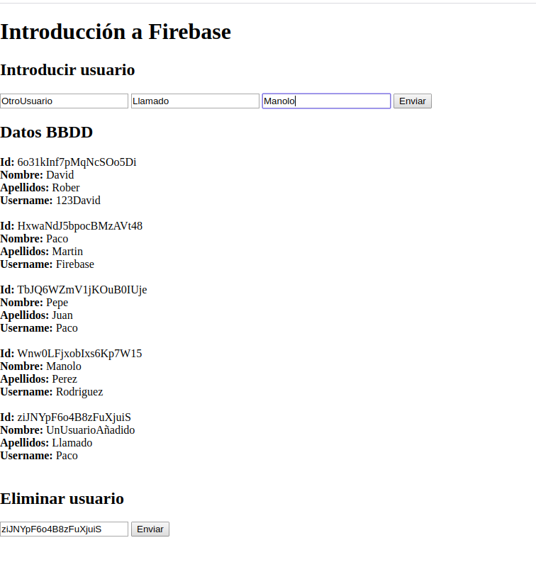
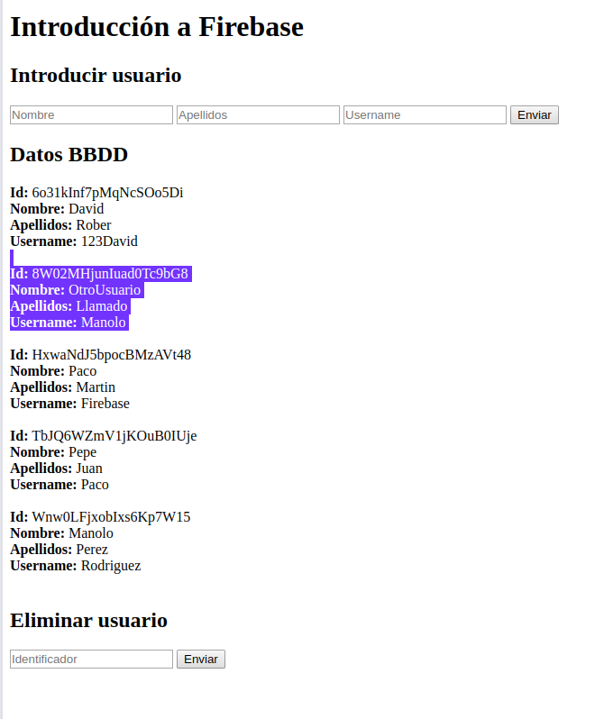

## Firebase

Firebase es una solución en la nube para despreocuparte de muchas tareas engorrosas en la gestión del backend. 

De esta manera, solo te tienes que preocupar por desarrollar la parte visual de la aplicación, que todo el tema de datos, analíticas y demás son gestionadas por ellos.

Para empezar a utilizarla de forma gratuita y limitada, simplemente tienes que crearte una cuenta, crear un nuevo proyecto y conectar tu aplicación web con la API.

Una vez conectadas, en la parte web debes incorporar todo aquellos servicios que te interesen. En nuestro caso, solo utilizamos firestore, por lo que es el único que incorporamos.

Ya con eso, mirando la documentación, creamos una colección con keys generadas aleatorias, en las que se guarda nombre, apellido y nombre de usuario. 

La aplicación puede insertar y eliminar entradas a partir del ID.

Tal y como está configurado, todo se guarda en "/usuario" y, a continuación, se guarda un objeto con:

```javascript
{
    nombre: xxx,
    apellidos: yyy,
    username: zzz
}
```

con un ID aleatorio, unas rutas tal que así:

/usuario/zjJDmqAUdP2j/{}



