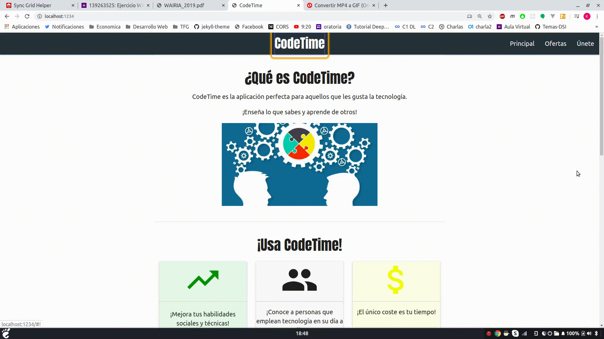
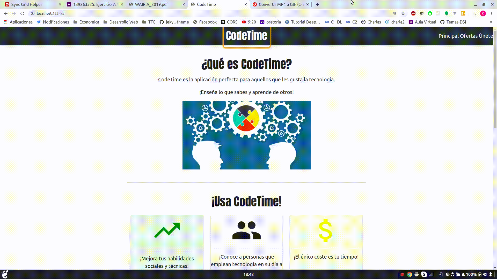

## Practica 8

Revisar las páginas con formularios que has desarrollado, localiza los siguiente elementos:

* Contenido que se actualiza dinámicamente, por ejemplo, mensajes que se actualizan automáticamente: chat, twitter, validación de formularios, banners, contadores, etc.
* Diferentes comportamientos en la página: menús, arcodeones, árboles desplegables, tooltips, pestañas, barras de progreso, etc.
* Relaciones entre elementos: ayuda contextual de los formularios, texto que describe elementos, etc.
* Los elementos que no reciben el foco

Etiqueta apropiadamente mediante WAI-ARIA para mejorar la accesibilidad de esta página. Prueba con Chrome Vox, antes y después de agregar los atributos WAI-ARIA

Crear un informe en el Readme de github que incluya gif animados con la verificación usando Chrome Vox.

## Mejorando practica 4

La práctica 4 era el desarrollo de una página de index utilizando materialize.

La práctica 4, antes de añadir WAI-ARIA, solo se podía navegar por el menú, pero no se podía ir a las imágenes ni leer los textos si no utilizabas el ratón para hacerle focus.

Para arreglarlo, se añadieron atributos de tabindex="0". Antes no se podía acceder porque el árbol DOM no utilizaba elementos que por defecto reciben el foco.

### Antes

### Despues

