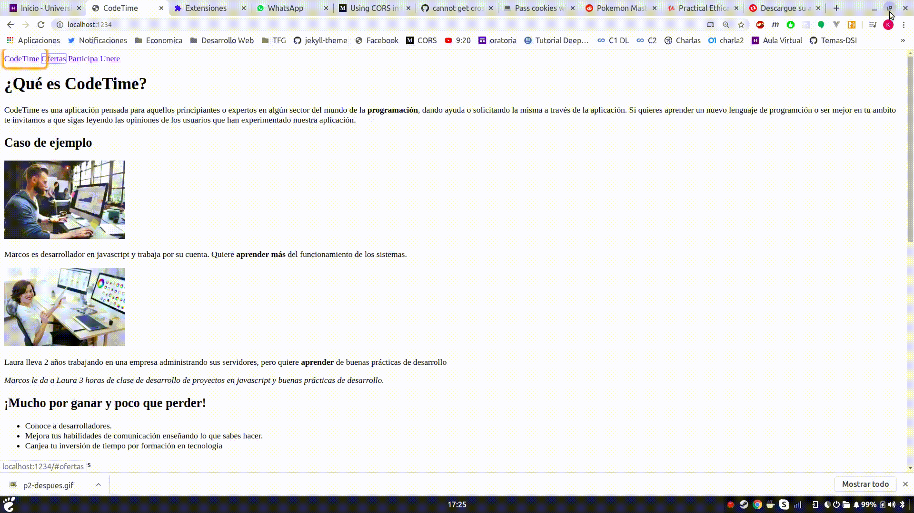

## Practica 8

Revisar las páginas con formularios que has desarrollado, localiza los siguiente elementos:

* Contenido que se actualiza dinámicamente, por ejemplo, mensajes que se actualizan automáticamente: chat, twitter, validación de formularios, banners, contadores, etc.
* Diferentes comportamientos en la página: menús, arcodeones, árboles desplegables, tooltips, pestañas, barras de progreso, etc.
* Relaciones entre elementos: ayuda contextual de los formularios, texto que describe elementos, etc.
* Los elementos que no reciben el foco

Etiqueta apropiadamente mediante WAI-ARIA para mejorar la accesibilidad de esta página. Prueba con Chrome Vox, antes y después de agregar los atributos WAI-ARIA

Crear un informe en el Readme de github que incluya gif animados con la verificación usando Chrome Vox.

## General

El mayor problema que se encontraba con la accesibilidad de las prácticas anteriores era relacionado con la tabulación. Esto se soluciona fácilmente utilizando el atributo tabindex.

## Mejorando practica 2

En esta práctica tuvimos que arreglar las tabulaciones y el texto de los formularios.

El usuario pasa por el título "Comienza ahora. Completa tu solicitud de registro" y luego pasa por los siguientes campos de texto en los que va a rellenar su información.

Para saber lo que tiene que introducir, se usa la etiqueta label que el propio lector lee lo que esta a la izquierda.

Como es HTML puro sin javascript ni nada, se podría mejorar más el formulario en el que, después de rellenarlo todo, si no es correcto, se reciban mensajes descriptivos del error que ocurrió y en que campo ocurrió, y como solucionarlo.

https://b3cl0s3r.github.io/UsabilidadYAccesibilidad/Practica2/

### Antes

### Despues

## Mejorando practica 3

La práctica 3 apenas se podía acceder a los contenidos. Le añadimos tabulación.

Primero se pasa por la primera y tercera columna debido a que es información relacionada y después de pasar por ahí pasa al contenido principal

En una web más seria debería existir un enlace o botón que permita saltarse las partes repetidas de la web.

El contenido del footer lo consideramos irrelevante como para pasar con el tab (copyright).

https://b3cl0s3r.github.io/UsabilidadYAccesibilidad/Practica3/index.html

### Antes

 

### Despues

## Mejorando practica 4

La práctica 4 era el desarrollo de una página de index utilizando materialize.

La práctica 4, antes de añadir WAI-ARIA, solo se podía navegar por el menú, pero no se podía ir a las imágenes ni leer los textos si no utilizabas el ratón para hacerle focus.

Para arreglarlo, se añadieron atributos de tabindex="0". Antes no se podía acceder porque el árbol DOM no utilizaba elementos que por defecto reciben el foco.

https://b3cl0s3r.github.io/UsabilidadYAccesibilidad/Practica4/

### Antes

### Despues

